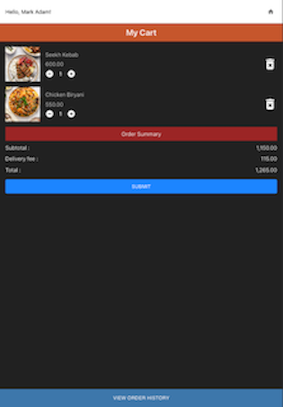

# Food Order App

![Food Order App]





A modern food ordering application that allows users to browse menus, add items to their cart, and place orders seamlessly.

---

## Table of Contents
1. [About the Project](#about-the-project)
2. [Features](#features)
3. [Project Demo](#project-demo)
4. [Prerequisites](#prerequisites)
5. [Installation](#installation)
6. [Usage](#usage)
7. [Scripts](#scripts)
8. [Technologies Used](#technologies-used)
9. [Contributing](#contributing)
10. [License](#license)
11. [Contact](#contact)

---

## About the Project

The **Food Order App** is a React-based web application designed to simplify the food ordering process. Users can browse through a variety of dishes, customize their orders, and place them with ease.

---

## Features

- Browse a wide variety of food items.
- Add items to the cart and adjust quantities.
- View total price and checkout.
- Responsive design for mobile and desktop.
- Built with React and modern web technologies.

---

## Project Demo


---

## Prerequisites

Before you begin, ensure you have the following installed:

- **Node.js** (v14 or later) - [Download Node.js](https://nodejs.org/)
- **npm** - Comes with Node.js

---

## Installation

1. Clone the repository:
   ```bash
   git clone https://github.com/ramkrishnakuldeep/online-ordering.git 
2. Navigate to the project folder:
   ```bash
   cd online-ordering
3. Install dependencies:
   ```bash
   npm install
4. Start the development server:
   ```bash
   npm run dev
---
## Usage
  1. Open your browser and navigate to http://localhost:5173/.
  2. Browse the menu and add items to your cart.
  3. Adjust quantities and proceed to checkout.
  4. Enjoy your food!
---
## Scripts

Here are the key npm commands for the project:

- Start the development server:
   ```bash
   npm run dev
- Build the application and optimize it for deployment. The output will be in the `dist` folder. 
   ```bash
   npm run build
- Continuously run tests as files are modified.
   ```bash
   npm run test
- Generate a detailed report of test coverage for the project.
   ```bash
   npm run coverage
---
## Technologies Used

- **React with TypeScript**: Build type-safe and scalable React applications.
- **Vite**: Fast development server and optimized production builds.
- **Redux Toolkit**: State management with Redux Toolkit for predictable state handling.
- **React Router**: Client-side routing for navigation.
- **Unit Testing**: Comprehensive tests using `vitest` and `@testing-library/react`.

## License
This project is licensed under the MIT License. See the LICENSE file for details.

## Contact

- **Kuldeep Bhimte**: kuldeipbhimte@gmail.com
- **GitHub**https://github.com/ramkrishnakuldeep
- ***LinkedIn**: https://www.linkedin.com/in/kuldeep-bhimte-16004224/ 