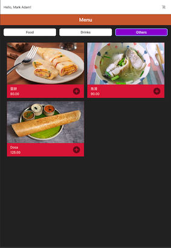
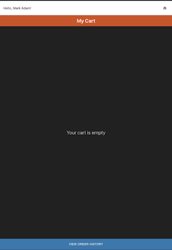
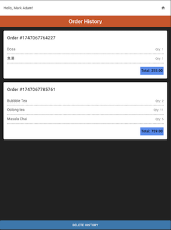

## Project Overview

The **Food Order App** is a modern web application designed to provide a seamless food ordering experience. It allows users to:

- Browse through a variety of food items and menus.
- Add selected items to their cart.
- Place orders with ease.
- View their order history for reference.

This project is built using **React** for the frontend, ensuring a responsive and user-friendly interface. The app is designed to be scalable and maintainable, making it suitable for real-world use cases in the food delivery industry.

Key highlights of the project include:
- Intuitive UI/UX design for effortless navigation.
- Dynamic cart management with real-time updates.
- Persistent order history for user convenience.
- Modular and reusable components for efficient development.

The application is ideal for learning React concepts such as state management, component-based architecture, and API integration.

## Screenshots








## Table of Contents
1. [About the Project](#about-the-project)
2. [Features](#features)
3. [Project Demo](#project-demo)
4. [Prerequisites](#prerequisites)
5. [Installation](#installation)
6. [Usage](#usage)
7. [Scripts](#scripts)
8. [Technologies Used](#technologies-used)
9. [Contributing](#contributing)
10. [License](#license)
11. [Contact](#contact)

## About the Project

The **Food Order App** is a React-based web application designed to simplify the food ordering process. Users can browse through a variety of dishes, customize their orders, and place them with ease.

## Features

- Browse a wide variety of food items
- Add items to the cart and adjust quantities
- View total price and checkout
- Responsive design for mobile and desktop
- Built with React and modern web technologies

## Project Demo


## Prerequisites

Before you begin, ensure your system meets the following requirements:

- **Node.js**: Version 14 or later - [Download Node.js](https://nodejs.org/)
  - Verify installation by running:
    ```bash
    node -v
    ```
- **npm**: Comes bundled with Node.js (ensure it is up-to-date)
  - Verify installation by running:
    ```bash
    npm -v
    ```

### Programming Language and Framework
- **Programming Language**: JavaScript/TypeScript (ES6+)
- **Framework**: React (v19.1.0 or latest)

## Installation

Follow these steps to set up the project on your local machine:

1. **Clone the Repository**:
   Use Git to clone the repository to your local machine:
   ```bash
   git clone https://github.com/ramkrishnakuldeep/online-ordering.git
   ```

2. **Navigate to the project folder:**
   Change into the project folder:
   ```bash
   cd online-ordering
   ```

3. **Install dependencies:**
   Install all required dependencies using npm:
   ```bash
   npm install
   ```

4. **Start the development server:**
   Run the application locally:
   ```bash
   npm run dev
   ```
5. **Open in Browser**
   The application will be available at:
   ```bash
   http://localhost:5176/
   ```

6. **Electron app**
   Alternatively, an Electron app will launch with the same functionality.


## Usage

1. Browse the menu and add items to your cart
2. Adjust quantities and proceed to checkout
3. View your order history
4. Enjoy your food!

### Scripts
- Start the development server:
   ```bash
   npm run dev
   ```

- Start the development server:
   ```bash
   npm run dev
   ```

- Build the application:
   ```bash
   npm run build
   ```

- Run tests:
   ```bash
   npm run test
   ```

## Test Coverage


Includes comprehensive unit and integration tests to ensure the reliability and correctness of the application. The test coverage report provides insights into the following metrics:

- **Statements**: 77% of executable code statements covered by tests.
- **Branches**: 90% of conditional branches (e.g., `if`/`else` statements) tested.
- **Functions**: 82% of functions or methods covered by tests.
- **Lines**: 77% of code lines executed during testing.

### How to Run Tests
To generate the test coverage report, follow these steps:
   ```bash
   npm run coverage
   ```

## Technologies Used

### Frontend
- **React with TypeScript**: Build type-safe and scalable React applications
- **Vite**: Fast development server and optimized production builds
- **Redux Toolkit**: State management with Redux Toolkit for predictable state handling
- **React Router**: Client-side routing for navigation
- **Unit Testing**: Comprehensive tests using `vitest` and `@testing-library/react`
- **Linting and Formatting**: Used BiomeJS

## License

This project is licensed under the MIT License. See the LICENSE file for details.

## Contact

- **Kuldeep Bhimte**: [kuldeipbhimte@gmail.com](mailto:kuldeipbhimte@gmail.com)
- **GitHub**: [ramkrishnakuldeep](https://github.com/ramkrishnakuldeep)
- **LinkedIn**: [Kuldeep Bhimte](https://www.linkedin.com/in/kuldeep-bhimte-16004224/) 